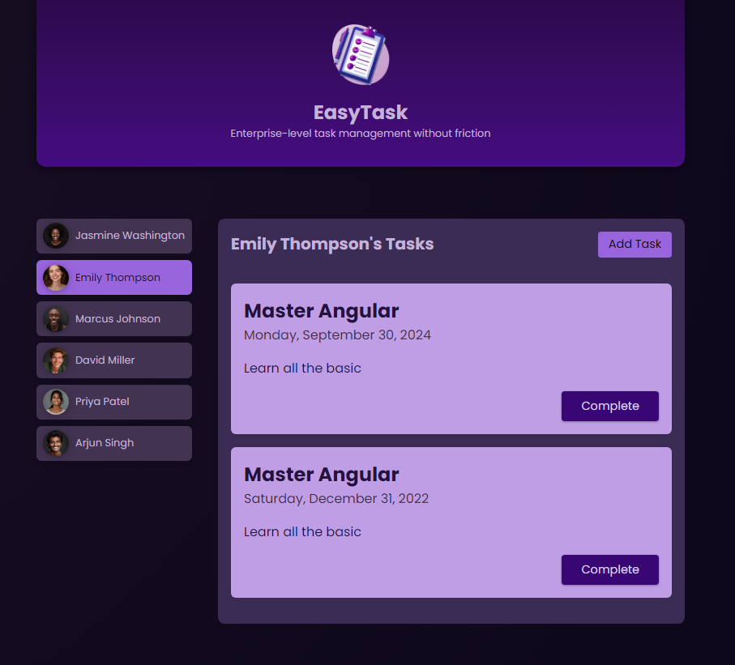

# TODO Application

## Description
This is a TODO application that allows users to manage individual tasks efficiently.

## Features
- Add, view, and complete tasks
- User-specific task management

## Technology
- **Framework**: Angular Core 18

## Topics Covered
- Components & Templates
- Directives
- Pipes and Custom Pipes
- Services
- Dependency Injection
- Change Detection

## Screenshot

